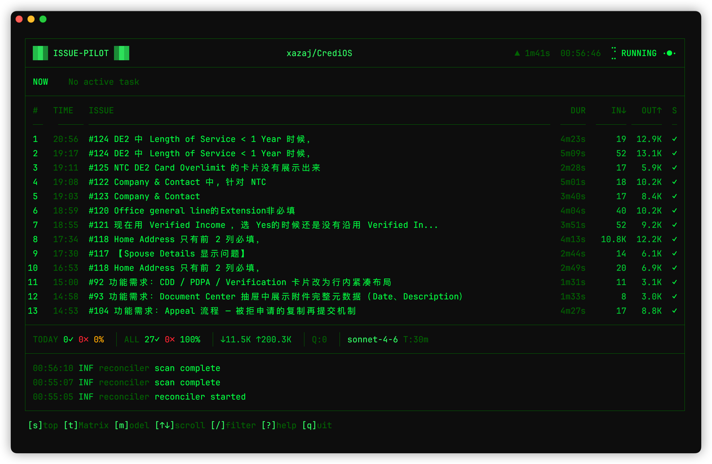

<div align="center">

# Issue-Pilot

**Label an issue, AI handles it for you.**

[](LICENSE)
[](https://nodejs.org/)
[](https://www.typescriptlang.org/)

[中文](README.md)

<br>



</div>

---

## What is this?

Issue-Pilot is a locally-running AI task scheduling tool. Label a GitHub Issue, and it automatically dispatches [Claude Code](https://docs.anthropic.com/en/docs/claude-code) to handle it — analyze problems, answer questions, or even write code and open PRs.

It runs as a daemon on your machine, continuously polling GitHub for new tasks, claiming them, executing via AI, and reporting results back to the issue. No servers, no third-party services — just install and run.

## Why?

Claude Code is great at coding tasks, but the manual loop — copy issue content, paste into terminal, wait, go back and update the issue — is repetitive enough to warrant automation.

Issue-Pilot turns that into:

```
You label → Issue-Pilot detects → Claude Code executes → Results posted back
```

You manage the issues. AI does the rest.

## Quick Start

### 1. Install

```bash
npm install -g issue-pilot
```

### 2. Configure

You need two things: a GitHub token and a workflow file.

**Set your token:**

```bash
export GITHUB_TOKEN=ghp_xxxxxxxxxxxx
```

> You can also put it in `~/.issue-pilot/.env`.

**Create a workflow file:**

The workflow file is Markdown — YAML config on top, AI prompt template below.

```bash
mkdir -p ~/.issue-pilot
curl -o ~/.issue-pilot/WORKFLOW.md \
  https://raw.githubusercontent.com/xazaj/issue-pilot/main/WORKFLOW.example.md
```

Edit `WORKFLOW.md` and fill in the three required fields:

```yaml
---
repo_owner: "your-org"          # GitHub username or organization
repo_name: "your-repo"          # Repository name
working_dir: "/path/to/repo"    # Absolute path to local clone
---
```

The prompt section is fully customizable. Need issue triage? Write a triage prompt. Need code changes? Write a coding prompt. **The workflow file defines what the AI does.**

### 3. Create Labels

In your target repository's **Settings → Labels**, create these labels (names are configurable):

| Label | Purpose |
|-------|---------|
| `pilot:ready` | Task is ready for AI execution |
| `pilot:in-progress` | Task is being processed |
| `pilot:failed` | Execution failed, needs attention |

### 4. Run

```bash
issue-pilot
```

Label any issue with `pilot:ready` to trigger execution.

## How It Works

The architecture borrows the reconciliation loop pattern from Kubernetes controllers:

```
GitHub Issues                     Issue-Pilot (local)

 Issue #42                        ┌──────────────┐
 [pilot:ready]  ─────────────────>│  Reconciler   │ polls GitHub every 30s
                                  └──────┬───────┘
                                         │ found a task
                                  ┌──────▼───────┐
                                  │  Dispatcher   │ serial queue scheduling
                                  └──────┬───────┘
                                         │
                                  ┌──────▼───────┐
                                  │    Runner     │ launches Claude Code
                                  └──────┬───────┘
                                         │
 Issue #42                               │
 [pilot:in-progress]  <──────────────────┘
 Claude analyzes code, writes comments, opens PRs…
```

Why polling over webhooks? This is a local tool — no public IP for webhook delivery. Polling is also naturally fault-tolerant: after a process restart, unfinished tasks are automatically rediscovered. Network interruptions resolve on the next poll cycle. No special recovery logic required.

## Run Modes

**Headless** — background execution with structured JSON logs:

```bash
issue-pilot                          # auto-discovers WORKFLOW.md
issue-pilot /path/to/WORKFLOW.md     # specify workflow file
```

**TUI** — interactive terminal dashboard:

```bash
issue-pilot-tui
```

## Workflow File Lookup

```
1. CLI argument path
2. ./WORKFLOW.md (current directory)
3. ~/.issue-pilot/WORKFLOW.md (global default)
```

## Configuration Reference

### Runtime Config

| Parameter | Default | Description |
|-----------|---------|-------------|
| `repo_owner` | *required* | GitHub username or organization |
| `repo_name` | *required* | Repository name |
| `working_dir` | *required* | Absolute path to local repo clone |
| `poll_interval` | `30` | Polling interval (seconds) |
| `ready_label` | `pilot:ready` | Trigger label |
| `in_progress_label` | `pilot:in-progress` | In-progress label |
| `failed_label` | `pilot:failed` | Failure label |
| `model` | `claude-sonnet-4-6` | Claude model |
| `max_outer_turns` | `5` | Max outer retry loops |
| `claude_max_turns` | `50` | Max agentic turns per session |
| `task_timeout_minutes` | `30` | Task timeout (minutes) |
| `heartbeat_timeout_minutes` | `5` | No-output timeout (minutes) |
| `assignee` | `""` | Only handle issues assigned to this user |
| `log_level` | `info` | Log level |

### Template Variables

Available Mustache variables for the prompt body:

`{{issue_number}}` `{{issue_title}}` `{{issue_body}}` `{{issue_url}}` `{{issue_labels}}` `{{issue_assignees}}` `{{repo_owner}}` `{{repo_name}}`

## Fault Recovery

The reconciliation loop architecture provides automatic recovery for most failure scenarios:

| Scenario | Recovery |
|----------|----------|
| Process crash or restart | Automatically rediscovers unfinished tasks |
| Claude process hang | Terminated after 5 minutes of silence |
| Task timeout | Hard timeout at 30 minutes, marked as failed |
| Network interruption | Retries on next poll cycle |
| GitHub API rate limit | Octokit handles 429 retries internally |
| Labels manually changed | Reads fresh state on every scan |

When a task fails, Issue-Pilot posts a diagnostic comment on the issue (failure reason, turns completed, token usage). Re-label with `pilot:ready` to retry.

## Run from Source

```bash
git clone https://github.com/xazaj/issue-pilot.git
cd issue-pilot
npm install
npm start           # Headless mode
npm run tui         # TUI mode
npm run dev         # Dev mode (auto-restart on changes)
```

## Requirements

- **Node.js 22+**
- **Claude Code CLI** (installed and authenticated)
- **GitHub Token** (issues read/write + repo read)

## Roadmap

### v1.0 — Single Workflow (current)

One workflow file, one trigger label. Suitable for issue analysis and commenting.

### v1.1 — Multi-Workflow Dispatch

Support a `workflows/` directory with label-based routing. Ships with built-in templates:

| Label | Workflow | What AI does |
|-------|----------|-------------|
| `pilot:qa` | Q&A | Read codebase, answer technical questions in issues |
| `pilot:fix` | Bug fix | Locate bug, fix code, create PR |
| `pilot:impl` | Feature | Implement feature from requirements, create PR |

### v1.2 — Workflow Types

Introduce a `type` field so the framework handles mechanical operations (branching, committing, opening PRs) while prompts focus purely on thinking:

```yaml
---
trigger_label: "pilot:fix"
type: "pr"                  # framework manages branch and PR lifecycle
branch_prefix: "fix/"
---
(prompt focuses on understanding and fixing the bug)
```

| type | Framework handles | Prompt handles |
|------|-------------------|----------------|
| `comment` | Post comment | Analyze and compose answer |
| `pr` | Create branch, commit, open PR, link issue | Understand requirements, write code |
| `review` | Fetch diff, submit review | Analyze code quality, suggest improvements |

### v1.3 — Pipelines & Concurrency

- Workflow chaining: analyze → human approval → implement → review, driven by label transitions
- Concurrent execution: isolated via git worktree, multiple tasks in parallel

## License

[MIT](LICENSE)
